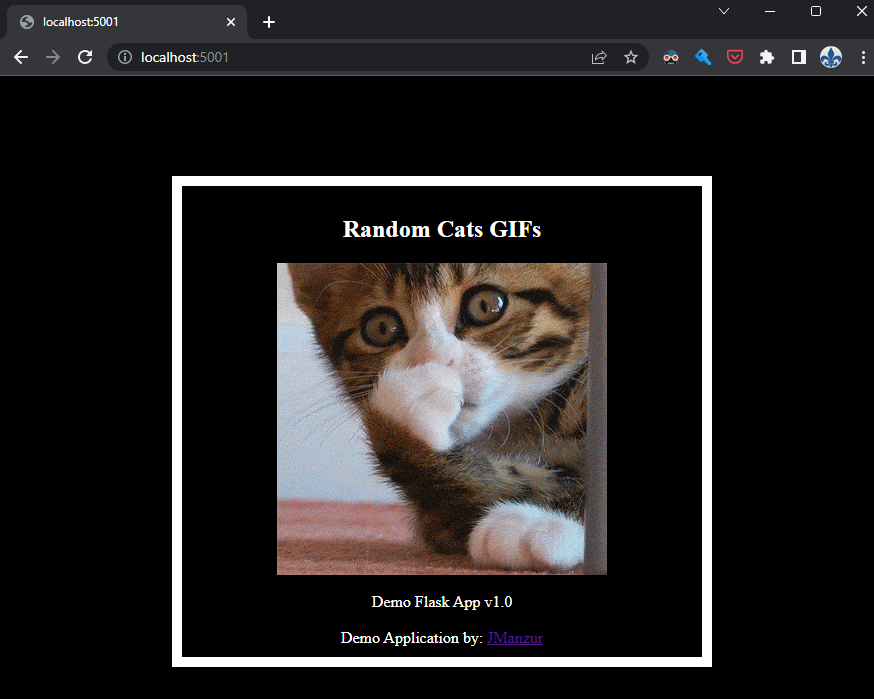
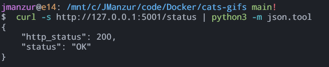

# Demo Web App using Flask

This simple image deploy a "web app" that show random cats GIFs from a list of images declared in the app.py file.

The flask app also provided a healthcheck status page.

## Tested with: 

| Environment | Application | Version  |
| ----------------- |-----------|---------|
| WSL2 Ubuntu 20.04 | Docker | 20.10.7  |
| WSL2 Ubuntu 20.04 | aws-cli | v2.2.12 |
| WSL2 Ubuntu 20.04 | Python | 3.8.5 |


## Run app.py Locally

Clone the project

```bash
  git clone https://github.com/JManzur/cats-gifs.git
```

Go to the project directory

```bash
cd cats-gifs
```

If you wish to test the python app locally, install the requirements:

```bash
pip3 install -r requirements.txt
```

Start the server

```bash
python3 app.py
```

Access the web app: [http://127.0.0.1:5001/](http://127.0.0.1:5001/)

And you will see something like this:



## Test the healthcheck status page

In order to test the healthcheck status page, you can access [http://127.0.0.1:5001/status](http://127.0.0.1:5001/status) in a browser or perform a curl like this:

```bash
curl -s http://127.0.0.1:5001/status
```

:bulb: **TIP**: Use "python -m json.tool" to prettify the json output

```bash
curl http://127.0.0.1:5001/status | python3 -m json.tool
```



## Build the Docker image 

Form the project directory run:

```bash
docker build -t cats-gifs .
```

## Run the Docker image Locally

After building the image if you wish to test it locally run the following command.

```bash
docker run -d -p 5001:5001 --name cats-gifs cats-gifs
```

## Author

- [@jmanzur](https://jmanzur.com)

## Documentation

- [Python - Docker Official Images](https://hub.docker.com/_/python)
- [Online GUID / UUID Generator](https://www.guidgenerator.com/)
- [py-healthcheck library](https://pypi.org/project/py-healthcheck/)
